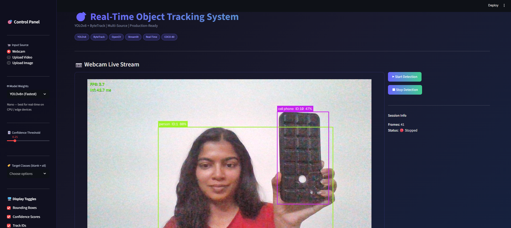
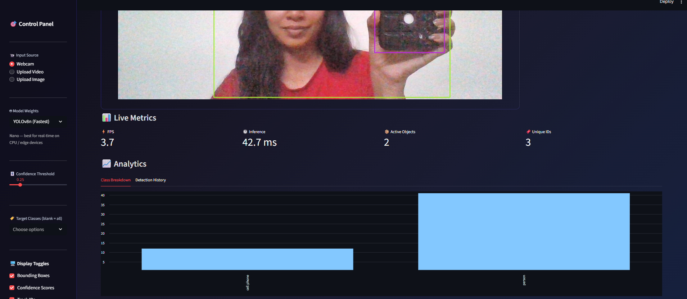
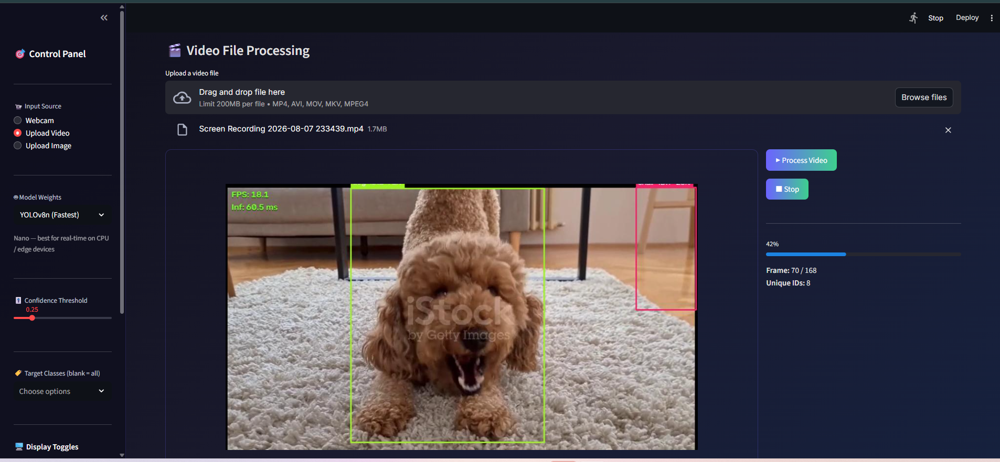
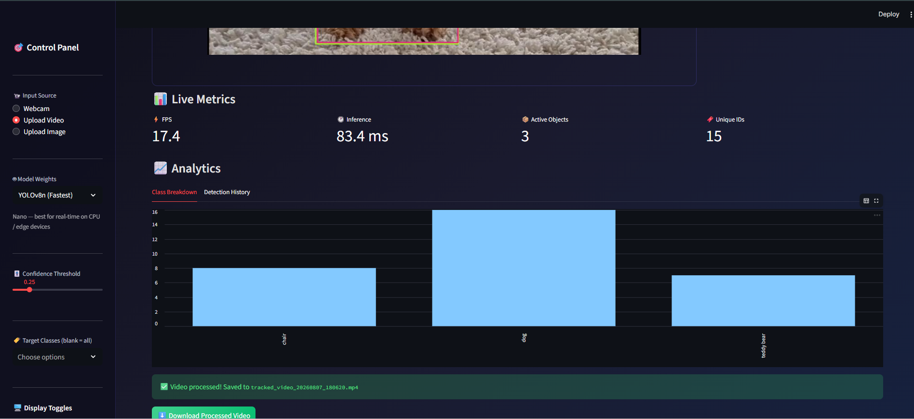
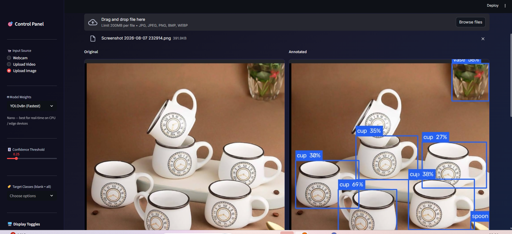
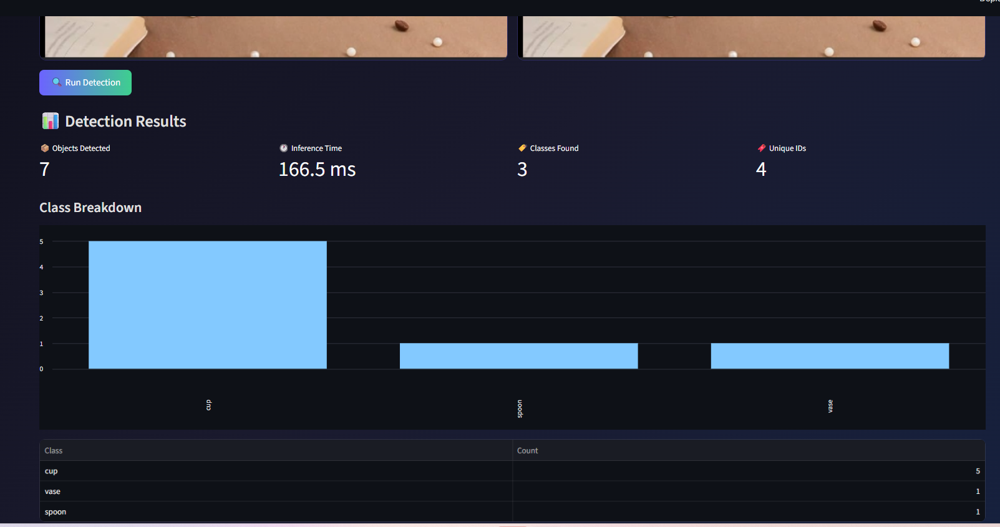

# Real-Time Object Tracking System 🎯

[](https://python.org)
[](https://ultralytics.com)
[](https://github.com/ifzhang/ByteTrack)
[](https://streamlit.io)
[](https://opencv.org)

A modular real-time object detection and tracking system built with **YOLOv8**, **ByteTrack**, and **Streamlit**.  
Supports **webcam streams**, **video file upload**, and **static image processing** — all in one interactive app.

---

## 📸 Screenshots

### 📷 Webcam Detection



### 🎬 Video Tracking



### 🖼️ Image Detection



---

## ✨ Features

| Feature | Details |
|---|---|
| **Detection Engine** | Pretrained YOLOv8n / YOLOv8s / YOLOv8m (auto-download) |
| **Tracking Algorithm** | ByteTrack via Ultralytics — persistent IDs across frames |
| **Input Sources** | Webcam · MP4/AVI/MOV upload · JPG/PNG upload |
| **Class Filtering** | All 80 COCO classes, multi-select whitelist |
| **Confidence Slider** | 0.10 – 1.00, adjustable at runtime |
| **Live Metrics** | FPS · Inference ms · Active objects · Total unique IDs |
| **Analytics** | Class-wise bar chart + scrollable detection history log |
| **Export** | Annotated video → `./outputs/` + one-click Streamlit download |
| **Color Coding** | Deterministic HSV colors per track ID — no flickering |

---

## 🔄 How It Works

```
Camera / Image / Video
          │
          ▼
OpenCV reads each frame as a BGR array
          │
          ▼
Pretrained YOLOv8 detects objects in the frame
(outputs bounding boxes + class labels, independently per frame)
          │
          ▼
ByteTrack assigns persistent IDs across consecutive frames
(uses Kalman Filter + Hungarian Algorithm to link detections over time)
          │
          ▼
Bounding boxes, class labels, and track IDs drawn on frame
          │
          ▼
Displayed live in Streamlit browser UI
```

**OpenCV** handles camera access and frame I/O.  
**YOLOv8** detects which objects are present in each frame — but has no memory of previous frames.  
**ByteTrack** solves the association problem: it links detections across frames so the same physical object keeps the same ID while visible.  
**Streamlit** renders the annotated frames and metrics in the browser.

---

## 📊 Results

- Detects **80 COCO object classes** (person, car, bicycle, chair, laptop, bottle, and more)
- Maintains **persistent track IDs** across frames using ByteTrack
- Supports **three input modes**: webcam, video upload, image upload
- Displays **live FPS, inference time, object count, and unique ID count**
- Exports **annotated video** and **annotated images** for download
- Adjustable **confidence threshold** and **class filter** at runtime

---

## 🗂️ Project Structure

```
real-time-object-tracking-opencv/
│
├── app.py              ← Streamlit UI entry point
├── detector.py         ← YOLOv8Detector (detection-only helper)
├── tracker.py          ← ObjectTracker (ByteTrack integration)
├── utils.py            ← Drawing, FPS, VideoWriter, helpers
├── config.py           ← Constants, paths, CSS, color palette
├── requirements.txt    ← Python dependencies
├── README.md           ← This file
│
├── models/             ← YOLOv8 weight files (auto-downloaded)
├── outputs/            ← Processed video / image exports
├── uploads/            ← Temporary uploaded media
├── assets/             ← Custom CSS / branding
└── screenshots/        ← UI screenshots for docs
```

---

## 🚀 Quick Start

### 1. Clone & enter the repo

```bash
git clone https://github.com/Vinyaaggarwal/real-time-object-tracking-opencv.git
cd real-time-object-tracking-opencv
```

### 2. Create a virtual environment (recommended)

```bash
python -m venv .venv
# Windows
.venv\Scripts\activate
# macOS / Linux
source .venv/bin/activate
```

### 3. Install dependencies

```bash
pip install -r requirements.txt
```

### 4. Launch the Streamlit app

```bash
streamlit run app.py
```

The browser will open at **http://localhost:8501** automatically.  
On first run, YOLOv8 weights are downloaded to `./models/` (~6 MB for nano).

---

## 🎛️ Usage Guide

### Sidebar Controls

| Control | Description |
|---|---|
| **Input Source** | Choose Webcam / Upload Video / Upload Image |
| **Model Weights** | YOLOv8n (fastest) · YOLOv8s (balanced) · YOLOv8m (accurate) |
| **Confidence** | Minimum detection score (0.10 – 1.00) |
| **Target Classes** | Whitelist specific COCO classes (blank = all 80) |
| **Display Toggles** | Show/hide boxes, confidence, IDs, FPS overlay, stats panel |

### Webcam Mode
1. Select **Webcam** in the sidebar.
2. Click **▶ Start Detection**.
3. Watch live bounding boxes + track IDs update in real time.
4. Click **⏹ Stop Detection** to end the session.

### Video Mode
1. Select **Upload Video** and drop an MP4/AVI/MOV file.
2. Click **▶ Process Video**.
3. Watch the live preview + progress bar.
4. Download the processed MP4 via the **⬇️ Download** button.

### Image Mode
1. Select **Upload Image** and drop a JPG/PNG.
2. Click **🔍 Run Detection**.
3. Compare original vs. annotated side-by-side.
4. Download the annotated PNG.

---

## 🤖 Dataset

The detector uses **pretrained YOLOv8 weights trained on the COCO dataset** — no custom training required.

**COCO (Common Objects in Context)** is a large-scale benchmark dataset containing:
- 330,000+ real-world images
- 1.5 million annotated object instances
- **80 object classes** including:

```
person · bicycle · car · motorcycle · bus · truck
dog · cat · horse · cow · bird · sheep
chair · couch · bed · dining table · toilet
laptop · cell phone · keyboard · mouse · tv
bottle · cup · fork · knife · pizza · sandwich
sports ball · tennis racket · skateboard · surfboard
...and more
```

This means the system works immediately, without any labelling or training — the pretrained weights already encode knowledge of these 80 classes learned from millions of annotated images.

---

## ⚡ Performance

Performance depends on hardware, model size, and input resolution.

| Model | Parameters | CPU Speed | Accuracy | Best For |
|---|---|---|---|---|
| **YOLOv8n** (nano) | 3.2 M | ~10–15 FPS | Good | Real-time webcam on CPU |
| **YOLOv8s** (small) | 11.2 M | ~5–10 FPS | Better | Balanced speed and accuracy |
| **YOLOv8m** (medium) | 25.9 M | ~2–5 FPS | Best | Accuracy-focused, GPU recommended |

> Inference times measured on a mid-range laptop CPU. GPU (CUDA) inference is 10–40× faster.

**YOLOv8n is the default** — it is the fastest COCO-pretrained model and runs comfortably in real time on CPU hardware.

---

## 🏗️ Architecture

```
┌─────────────────────────────────────────────────┐
│                   app.py (UI)                   │
│  Sidebar ─ Header ─ Mode Router ─ Metrics       │
└────────────────────┬────────────────────────────┘
                     │ calls
        ┌────────────▼────────────┐
        │    tracker.py           │
        │  ObjectTracker          │
        │  ├─ YOLO.track()        │
        │  ├─ ByteTrack state     │
        │  └─ Session stats       │
        └────────────┬────────────┘
                     │ uses
        ┌────────────▼────────────┐
        │    utils.py             │
        │  draw_tracked_boxes()   │
        │  FPSCounter             │
        │  VideoWriterCtx         │
        │  frame_to_base64_html() │
        └─────────────────────────┘
        ┌─────────────────────────┐
        │    config.py            │
        │  Paths · Models · CSS   │
        │  COCO classes · Colors  │
        └─────────────────────────┘
```

---

## 📦 Dependencies

| Package | Version | Purpose |
|---|---|---|
| `streamlit` | ≥ 1.28 | Web UI framework |
| `ultralytics` | ≥ 8.0 | YOLOv8 + ByteTrack |
| `opencv-python-headless` | ≥ 4.8 | Frame I/O, drawing |
| `numpy` | ≥ 1.24 | Array operations |
| `Pillow` | ≥ 9.5 | Image codec |
| `pandas` | ≥ 2.0 | Analytics tables |

---

## ⚙️ Configuration

Edit `config.py` to customise:
- `DEFAULT_CONFIDENCE` — default confidence threshold
- `DEFAULT_IOU` — NMS IOU threshold
- `DEFAULT_IMG_SIZE` — inference resolution
- `MODEL_CONFIGS` — add custom YOLOv8 variants
- `STREAMLIT_CUSTOM_CSS` — tweak the UI theme

---

## 🚧 Known Limitations

| Limitation | Explanation |
|---|---|
| **Occlusion → ID switch** | When objects overlap for extended frames, ByteTrack may assign a new ID on reappearance |
| **Small / blurred objects** | Objects far from camera or in motion blur may be missed at 640×640 input size |
| **Fixed 80-class vocabulary** | Cannot detect hands, faces, or custom objects without fine-tuning |
| **CPU is slower than GPU** | Inference on CPU is 10–40× slower than on a CUDA GPU |
| **2D tracking only** | No depth information — cannot measure distance or track in 3D |

---

## 🔮 Future Enhancements

- [ ] **DeepSORT tracker** support alongside ByteTrack
- [ ] **Multi-camera** tracking across streams
- [ ] **Line-crossing object counter** (entry/exit counting)
- [ ] **Region-of-interest (ROI)** monitoring with alerts
- [ ] **GPU / TensorRT** acceleration for real-time on larger models
- [ ] **Cloud deployment** via Streamlit Community Cloud or Hugging Face Spaces
- [ ] **Custom model support** — plug in fine-tuned `.pt` files for specific use cases
- [ ] **Heatmap overlay** showing object density over time

---

## 📝 License

MIT — see `LICENSE` for details.

---

## 🤝 Contributing

Pull requests are welcome!  
Please open an issue first to discuss major changes.
